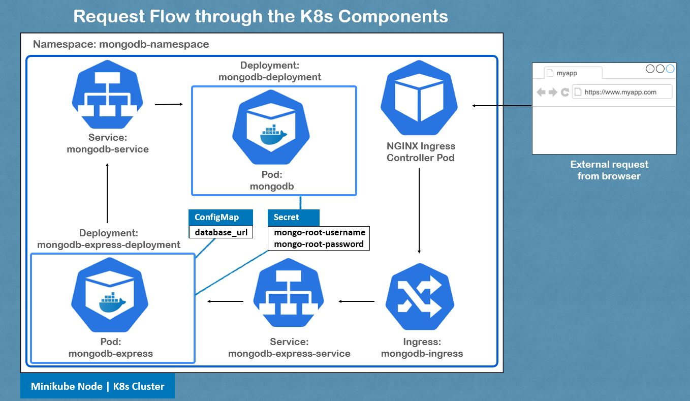

# Mongo Express on Kubernetes

This project implements a basic web-based MongoDB admin interface on a Minikube kubernetes cluster.

## Prerequisite

Make sure Minikube and kubectl are installed.

[kubectl installation](https://kubernetes.io/docs/tasks/tools/install-kubectl/)  
[Minikube installation](https://minikube.sigs.k8s.io/docs/start/)

## General Concepts

- A Pod is the smallest execution unit in Kubernetes, and an abstraction over containers. A container is a lightweight software that contains all the necessary tools, libraries and code to run an application.

  - `kubectl exec -it <pod_name> -- /bin/bash` to get a bash shell in the container.
  - `kubectl logs <pod_name>` to show information logged by a pod.

- A Deployment is a resource to describe how a ReplicaSet and Pod should behave.

  - `kubectl create deploy <deployment_name> --image=<image_name>` to create a basic deployment with minimal configurations.
  - `kubectl edit deploy <deployment_name>` to edit the configuration file of a deployment.
  - `kubectl delete deploy <deployment_name>` to delete a deployment.

- A ReplicaSet aims to maintain a stable set of Pods running at any given time. The number of Pods maintained is determined in the configuration file of a deployment.

- A Service exposes an application running on a set of Pods as a network service.

- A ConfigMap is used to store non-sensitive data in key-value pairs, and can be consumed as environment variables, command-line arguments, or as configuration files.

- A Secret is similar to a ConfigMap, but more towards storing sensitive data, such as passwords, OAuth tokens, and ssh keys.

  - `echo -n '<password>' | base64` to generate a base64 encoded string to be used as password in Secret, though a better hashing algorithm should be used.

- A Namespace is akin to a virtual cluster to organize resources between multiple teams, versions or environments.

  - `kubectl create namespace <name>` to create a namespace.

- An Ingress manages external access to services in a cluster. It provides load balancing, SSL termination and name-based virtual hosting. An Ingress consists of an Ingress Controller and Ingress Resource. An Ingress Controller reads information from an Ingress Resource then evaluates all the rules and manages redirections.

## Getting Started

1 - Start Minikube, which would start a local Kubernetes cluster.

- `minikube start` to start your cluster.
- `kubectl get no` to list all worker nodes.

2 - Create a Namespace, which is similar to a virtual cluster.

- `kubectl apply -f mongo-namespace.yml` to create the Namespace called mongodb-namespace.
- `kubectl delete -f mongo-namespace.yml` to delete the Namespace.
- `kubectl get ns` to list all Namespaces.

3 - Create a Secret, which is used to store sensitive information. The Secret will contain the username and password for MongoDB.

- `kubectl apply -f mongo-secret.yml` to create the Secret called mongodb-secret.
- `kubectl delete -f mongo-secret.yml` to delete the Secret.
- `kubectl get secret -n mongodb-namespace` to list all Secrets.

4 - Create a Deployment, which is used to manage Pods and ReplicaSets, and a Service, which defines a policy to access a set of Pods. The Deployment will contain a MongoDB Pod, and will use the username and password from Secret as the database credentials. The Service defined is an internal service, which is inaccessible outside of the Kubernetes cluster. It functions to enable other Pods within the cluster to communicate with the MongoDB Pod.

- `kubectl apply -f mongo.yml` to create the Service called mongodb-service, and Deployment called mongodb-deployment.
- `kubectl delete -f mongo.yml` to delete the Service and Deployment.
- `kubectl get svc -n mongodb-namespace` to list all Services.
- `kubectl get deploy -n mongodb-namespace` to list all Deployments.
- `kubectl get rs -n mongodb-namespace` to list all Replicasets.
- `kubectl get po -n mongodb-namespace` to list all Pods.
- `kubectl get all -n mongodb-namespace` to list all Services, Deployments, Replicasets and Pods.

5 - Create a ConfigMap, which is used to store non-confidential information in key-value pairs. The ConfigMap will contain the mongo database url.

- `kubectl apply -f mongo-configmap.yml` to create the Configmap called mongodb-configmap.
- `kubectl delete -f mongo-configmap.yml` to delete the Configmap.
- `kubectl get cm -n mongodb-namespace` to list all Configmaps.

6 - Create another Deployment and Service. The Deployment will contain a Mongo-Express Pod, which is a web-based interface to manage MongoDB databases. It will use the username and password from Secret, and the database url from ConfigMap to access the MongoDB internal Service defined in 4. The Service defined in 6 could be either an external or internal service. If it's an external service, it would allow external request to communicate with the Pods in 6. However, since an Ingress will be defined in 7, this Service will be an internal service, which would define the policy to access the Mongo-Express Pod.

- `kubectl apply -f mongo-express.yml` to create the Service called mongodb-express-service, and Deployment called mongodb-express-deployment.
- `kubectl delete -f mongo-express.yml` to delete the Service and Deployment.

7 - Create an Ingress resource, which defines rules on traffic routing, and an Ingress Controller (K8 Nginx), which manages external access to Services in a cluster. An external proxy server could be used to manage access to various clusters. Change the /etc/hosts file to map the host url stated in mongo-ingress.yml to the IP address of the Ingress Controller. Commented TLS key is used to enable HTTPS.

- `minikube addons enable ingress` to automatically start the K8s Nginx implementation of Ingress Controller.
- `kubectl get po -n kube-system` to verify the creation of the pod _ingress-nginx-controller._
- `kubectl apply -f mongo-ingress.yml` to create the Ingress called mongodb-ingress.
- `kubectl delete -f mongo-ingress.yml` to delete the Ingress.
- `kubectl get ing -n mongodb-namespace` to list all Ingresses.
